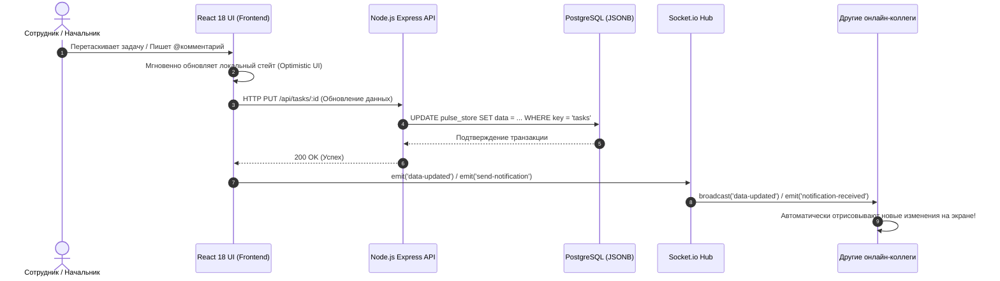

# 🛠️ Шаг 1: Стек технологий и архитектура проекта

В данном разделе подробно описаны технологии, использованные при разработке **Pulse12 FlowSpace**, а также архитектурная структура клиентской и серверной частей.

---

## 💻 1. Использованный стек технологий

### 🎨 Frontend (Клиентская часть)
* **[React 18](https://react.dev/) + [TypeScript](https://www.typescriptlang.org/):** Современная компонентная архитектура с полной статической типизацией всех моделей данных, что исключает ошибки выполнения (runtime errors).
* **[Vite 8](https://vitejs.dev/):** Сверхбыстрый сборщик нового поколения. Обеспечивает мгновенный горячий перезапуск (HMR) в режиме разработки и собирает оптимизированный production-бандл (весом менее 510 КБ) за ~400 миллисекунд.
* **[@hello-pangea/dnd](https://github.com/hello-pangea/dnd):** Высокопроизводительная библиотека для Drag-and-Drop, обеспечивающая плавное перетаскивание карточек между колонками на Kanban-доске.
* **[Lucide React](https://lucide.dev/):** Единая векторная библиотека современных корпоративных иконок (более 1000 иконок).
* **[Canvas Confetti](https://github.com/catdad/canvas-confetti):** Визуальные микро-анимации (праздничный салют) при переводе задач в статус «Выполнено» (`done`).
* **[Socket.io Client](https://socket.io/):** Клиент реального времени для получения push-уведомлений и синхронизации состояния доски со всеми коллегами в офисе.

### ⚙️ Backend (Серверная часть)
* **[Node.js](https://nodejs.org/) + [Express 5](https://expressjs.com/):** Легковесный и быстрый REST API сервер, обслуживающий запросы авторизации, управления задачами, пользователями и файлами.
* **[Socket.io Server](https://socket.io/):** Сервер WebSockets, обеспечивающий двустороннюю связь в реальном времени. При любом действии (создание задачи, смена статуса, комментарий) сервер мгновенно рассылает событие всем подключенным клиентам.
* **[node-postgres (pg)](https://node-postgres.com/):** Официальный драйвер PostgreSQL с поддержкой пула соединений (Connection Pool) и автоматическим восстановлением при сбоях сети.

### 🐳 Инфраструктура и контейнеризация
* **[Docker](https://www.docker.com/) + Docker Compose:** Полная изоляция сервисов в двух контейнерах (`pulse12-postgres` и `pulse12-corporate`) с автоматическими Healthcheck-проверками и постоянными томами хранения данных (`pgdata`).

---

## 📁 2. Структура директорий и файлов репозитория

```text
C:\...\jira-clone\
├── 📂 docs/                          # Корпоративная пошаговая документация
│   ├── README.md                     # Оглавление документации
│   ├── 01-STACK_AND_ARCHITECTURE.md  # Стек и архитектура (текущий файл)
│   ├── 02-DATABASE_AND_MODELS.md     # Описание PostgreSQL JSONB схемы и ER-диаграмм
│   ├── 03-DEPLOYMENT_AND_VSPHERE.md  # Инструкция по развертыванию в vSphere (VM) и Git
│   ├── 04-USER_AND_ADMIN_MANUAL.md   # Руководство пользователя, руководителя и админа
│   └── 05-ROADMAP_AND_FUTURE.md      # Дорожная карта и планы развития
│
├── 📂 server/                        # Backend REST API + WebSockets сервер
│   ├── index.js                      # Главный файл сервера (Express API + Socket.io hub)
│   ├── db.js                         # PostgreSQL адаптер с Dual-Mode (автопереключение на db.json)
│   ├── initialData.js                # Стартовые корпоративные данные (12 сотрудников, спринты)
│   └── db.json                       # Файловая NoSQL база данных (резервный fallback режим)
│
├── 📂 src/                           # Frontend исходный код (React 18 + TS)
│   ├── 📂 components/                # UI компоненты системы
│   │   ├── 📂 AdminPanel/            # Админка: валидация дубликатов, поиск, экспорт, массовое удаление
│   │   ├── 📂 Analytics/             # Аналитика: точный учет времени, статистика по статусам
│   │   ├── 📂 Backlog/               # Бэклог спринтов, фильтрация по задачам
│   │   ├── 📂 Header/                # Верхняя панель: выбор спринта, поиск, переключатель темы
│   │   ├── 📂 KanbanBoard/           # Доска: Drag-Drop колонки, баннер Burn-down спринта
│   │   ├── 📂 Notifications/         # Центр уведомлений и всплывающие 10-секундные тосты
│   │   ├── 📂 TaskModal/             # Модальное окно задачи: таймер, @упоминания, чек-лист команды
│   │   └── 📂 TeamWorkload/          # Загрузка команды: матрица задач по каждому сотруднику
│   │
│   ├── 📂 context/                   # Глобальный стейт приложения (React Context API)
│   │   ├── AuthContext.tsx           # Авторизация, сессии, автовыход через 15 минут неактивности
│   │   └── TaskContext.tsx           # Задачи, сотрудники, фильтры, синхронизация сокетов
│   │
│   ├── 📂 types/                     # TypeScript интерфейсы (Task, User, Sprint, Group, Comment)
│   ├── App.tsx                       # Главный роутер, модальное окно сессии и предупреждения
│   ├── index.css                     # Дизайн-система (CSS-переменные, темная/светлая тема, glassmorphism)
│   └── main.tsx                      # Точка монтирования React приложения
│
├── docker-compose.yml                # Конфигурация Docker для запуска сервера и PostgreSQL 16
├── Dockerfile                        # Мультистейдж сборка (Vite build -> Node production runtime)
├── package.json                      # Зависимости проекта и скрипты (dev, build, start:prod, lint)
└── tsconfig.json                     # Настройки компилятора TypeScript
```

---

## 🔄 3. Как работает синхронизация в реальном времени (Архитектура потоков)

Когда руководитель или сотрудник совершает действие в системе (например, перетаскивает задачу или пишет комментарий), происходит следующий цикл:



1. **Optimistic UI:** Интерфейс обновляется мгновенно в браузере пользователя, не дожидаясь ответа сервера, что создает ощущение нулевой задержки.
2. **Фоновое сохранение:** В фоне отправляется HTTP-запрос к API, который записывает данные в PostgreSQL.
3. **Рассылка сокетов:** После сохранения сервер транслирует событие через Socket.io всем остальным коллегам, чьи браузеры синхронно перерисовывают карточки на доске.
