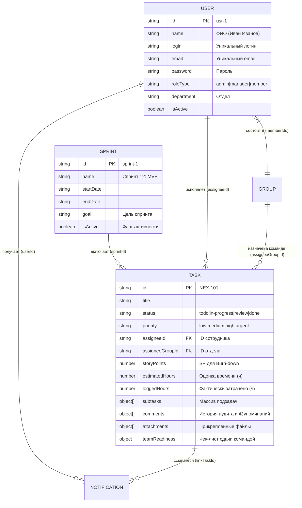

# 💾 Шаг 2: База данных, модели и резервное копирование

В данном документе подробно описано устройство базы данных **Pulse12 FlowSpace**, схема коллекций и руководство по резервному копированию (Backup / Restore).

---

## 🏛️ 1. Гибридная архитектура (JSONB Dual-Mode)

Система построена по паттерну **Dual-Mode Document-in-Relational Store**. В качестве основного хранилища используется реляционная СУБД **PostgreSQL 16**, в которой данные хранятся в формате бинарных JSON-документов (**`JSONB`**).

### Преимущества такого подхода:
1. **Гибкость без сложных миграций:** Мы можем мгновенно добавлять новые поля в задачи (например, таймер, чек-листы или теги) без выполнения DDL-запросов (`ALTER TABLE`) и риска остановить production-сервер.
2. **Атомарность и индексы:** PostgreSQL индексирует бинарный JSONB, обеспечивая скорость выборок на уровне традиционных реляционных таблиц.
3. **Бесшовный Fallback (Отказоустойчивость):** Если PostgreSQL становится недоступен (сбой сети, перезагрузка контейнера), сервер `server/db.js` автоматически переключается на работу с локальным файлом `db.json` без остановки API.

```sql
-- DDL схема создания главной таблицы хранения коллекций в PostgreSQL
CREATE TABLE IF NOT EXISTS pulse_store (
  key VARCHAR(64) PRIMARY KEY,      -- Имя коллекции: 'tasks', 'users', 'sprints', 'groups', 'notifications'
  data JSONB NOT NULL,              -- Массив объектов со всеми бизнес-сущностями
  updated_at TIMESTAMP DEFAULT CURRENT_TIMESTAMP
);
```

---

## 🔗 2. Логическая ER-схема и связи сущностей



---

## 📋 3. Структура коллекций данных (Модели)

В системе хранятся 5 основных коллекций данных:

### 👤 1. Коллекция сотрудников (`users`)
| Поле | Тип | Описание и валидация |
| :--- | :--- | :--- |
| **`id`** | `string` (PK) | Уникальный ID (например, `usr-1`). **Важно:** `usr-1` защищен от удаления. |
| **`name`** | `string` | Полное ФИО (например, `Иван Иванов`) |
| **`login`** | `string` (Unique)| Логин для входа. Строго проверяется на дубликаты при создании/изменении. |
| **`email`** | `string` (Unique)| Корпоративная почта. Строго проверяется на дубликаты. |
| **`password`** | `string` | Пароль для входа в систему |
| **`roleType`** | `string` | Уровень доступа: `admin` (Главный админ), `manager` (Руководитель), `member` (Специалист) |
| **`department`**| `string` | Отдел: `Разработка`, `Дизайн`, `Тестирование`, `Менеджмент`, `Инфраструктура` |
| **`telegramId`** | `string` | Telegram Chat ID для получения личных оповещений от бота `@pulse12_team_bot` |
| **`pin`** | `string` | 4-значный ПИН-код для быстрой смены аккаунта на демо-экране в офисе |
| **`isActive`** | `boolean`| Статус активности учетной записи |

### 📝 2. Коллекция задач (`tasks`)
| Поле | Тип | Описание |
| :--- | :--- | :--- |
| **`id`** | `string` (PK) | Системный номер тикета (например, `NEX-101`) |
| **`title` / `description`** | `string` | Название и подробное описание задачи |
| **`status`** | `string` | Текущая колонка: `todo` (К выполнению), `in-progress` (В работе), `review` (На проверке), `done` (Готово) |
| **`priority`** | `string` | Приоритет: `low` (Низкий), `medium` (Средний), `high` (Высокий), `urgent` (🔥 Срочный) |
| **`assigneeId`** | `string \| null`| ID назначенного сотрудника (или null / `unassigned`) |
| **`assigneeGroupId`** | `string \| null`| ID команды, если задача распределена на весь отдел |
| **`creatorId` / `creatorName`** | `string` | ID и ФИО автора (того, кто назначил или создал задачу) |
| **`dueDate`** | `string` (ISO) | Срок выполнения задачи (Дедлайн) |
| **`storyPoints`** | `number` | Вес задачи в SP, используемый для расчета прогресса Burn-down |
| **`estimatedHours`** | `number` | Норматив времени на выполнение (в часах) |
| **`loggedHours`** | `number` | Тайм-трекер: сколько часов фактически затрачено |
| **`sprintId`** | `string \| null`| Привязка к спринту (`sprint-1`) |
| **`subtasks`** | `Subtask[]` | Массив подзадач: `[{ id: "sub-1", title: "Сделать API", completed: true }]` |
| **`comments`** | `Comment[]` | История переписки, **логи аудита** (смена статуса/исполнителя) и **@упоминания** |
| **`attachments`**| `Attachment[]`| Загруженные документы и скриншоты (`url`, `filename`, `size`, `uploadedAt`) |
| **`teamReadiness`**| `Record<string, boolean>`| Чек-лист подтверждения готовности для командных задач: `{"usr-2": true, "usr-3": false}` |

### 🚀 3. Коллекция спринтов (`sprints`)
| Поле | Тип | Описание |
| :--- | :--- | :--- |
| **`id`** | `string` (PK) | Идентификатор спринта (`sprint-1`) |
| **`name`** | `string` | Название спринта (`Спринт 12: Релиз ядра`) |
| **`startDate` / `endDate`** | `string` (ISO)| Даты для таймера обратного отсчета (`⏳ Осталось дней: X`) |
| **`goal`** | `string` | Цель спринта, отображаемая на главном баннере доски |
| **`isActive`** | `boolean`| Флаг текущего активного спринта |

### 👥 4. Коллекция отделов и групп (`groups`)
| Поле | Тип | Описание |
| :--- | :--- | :--- |
| **`id`** | `string` (PK) | ID команды (`grp-dev`) |
| **`name`** | `string` | Название отдела (`Разработка (Backend/Frontend)`) |
| **`color`** | `string` | Цвет бейджа команды на карточках задач |
| **`memberIds`** | `string[]` | Массив ID сотрудников отдела: `["usr-1", "usr-2", "usr-5"]` |

### 🔔 5. Коллекция уведомлений (`notifications`)
| Поле | Тип | Описание |
| :--- | :--- | :--- |
| **`id`** | `string` (PK) | Уникальный ID оповещения |
| **`userId`** | `string` | Адресат уведомления (`usr-2` или глобально `'all'`) |
| **`title` / `message`**| `string` | Заголовок и текст (например, `🔔 VIP: Вас упомянул(а) Иван!`) |
| **`read`** | `boolean`| Прочитано ли уведомление |
| **`type`** | `string` | Категория: `task_assigned`, `status_changed`, `comment_added`, `general` |
| **`linkTaskId`** | `string` | ID задачи для автоперехода на доску при клике по уведомлению |

---

## 🛠️ 4. Скрипты резервного копирования (Backup & Restore)

Для обеспечения сохранности данных на корпоративном сервере vSphere рекомендуется настроить регулярное резервное копирование базы данных.

### 💾 1. Создание дампа (Экспорт БД)
Выполните команду в терминале сервера Ubuntu, чтобы сохранить дамп БД в файл `.sql`:
```bash
sudo docker exec -t pulse12-postgres pg_dump -U pulse12_admin pulse12 > /opt/pulse12/backups/pulse12_backup_$(date +%F_%H-%M).sql
```

### 🔄 2. Восстановление из дампа (Импорт БД)
Если вам необходимо восстановить базу данных из резервной копии:
```bash
cat /opt/pulse12/backups/pulse12_backup_2026-07-05_10-00.sql | sudo docker exec -i pulse12-postgres psql -U pulse12_admin -d pulse12
```

### ⏱️ 3. Автоматизация через Cron (Ежедневный бэкап в 02:00 ночи)
Добавьте задачу в системный планировщик cron (`sudo crontab -e`):
```cron
0 2 * * * /usr/bin/docker exec -t pulse12-postgres pg_dump -U pulse12_admin pulse12 > /opt/pulse12/backups/pulse12_$(date +\%F).sql 2>&1
```

---

## 🔑 7. Как изменить пароль Администратора напрямую в Базе Данных
Если доступ в админку утерян или нужно сбросить пароль пользователя с ID `usr-1`:

### В режиме PostgreSQL (через SQL-запрос):
Выполните команду в терминале:
```bash
docker exec -i pulse12-postgres psql -U pulse12_admin -d pulse12 -c "
UPDATE pulse_store 
SET data = jsonb_set(
  jsonb_set(data, '{users,0,password}', '\"newadmin2026\"'),
  '{users,0,pin}', '\"newadmin2026\"'
) 
WHERE key = 'pulse12_all';
"
docker compose restart pulse12-corporate
```
*Примечание: Сервер при старте автоматически превратит открытый пароль `"newadmin2026"` в защищенный bcrypt-хеш.*

### В режиме JSON-файла (`server/data/db.json`):
1. Откройте файл: `sudo nano /opt/pulse12/server/data/db.json`
2. Найдите пользователя с `"id": "usr-1"` и укажите новый пароль в полях `"password"` и `"pin"`.
3. Перезапустите сервер.

---

## ➕ 8. Как добавлять новые таблицы и коллекции

1. **Добавление новой JSON-коллекции в `pulse_store`**:
   Добавьте новый массив в структуру данных (например, `data.projects = []`). Метод `saveCollection('projects', projectsArray)` автоматически сохранит его в PostgreSQL.

2. **Создание классической реляционной SQL-таблицы в PostgreSQL**:
   Войдите в консоль: `docker exec -it pulse12-postgres psql -U pulse12_admin -d pulse12`
   Выполните SQL:
   ```sql
   CREATE TABLE IF NOT EXISTS custom_logs (
     id SERIAL PRIMARY KEY,
     event_name VARCHAR(100) NOT NULL,
     user_id VARCHAR(50),
     payload JSONB,
     created_at TIMESTAMPTZ DEFAULT NOW()
   );
   ```
