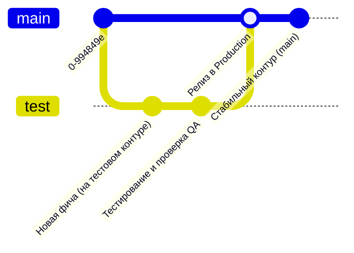

# 🌐 Шаг 3: Развертывание в vSphere и стратегия работы с Git

Данная инструкция предназначена для системных администраторов и DevOps-инженеров. В ней пошагово расписан процесс развертывания системы **Pulse12 FlowSpace** на виртуальной машине (VM) под управлением VMware vSphere / ESXi, требования к железу, настройка сетевого экрана и стратегия ветвления Git.

---

## 🖥️ 1. Системные требования к виртуальной машине (VMware vSphere)

Для стабильной работы системы (с учетом базы данных PostgreSQL, WebSocket-соединений и обработки файлов) выделите в vSphere виртуальную машину со следующими характеристиками:

| Параметр | Минимальные требования (до 30 пользователей) | Рекомендуемые требования (до 200+ пользователей) |
| :--- | :--- | :--- |
| **Операционная система** | Ubuntu Server 22.04 LTS / 24.04 LTS (64-bit) | Ubuntu Server 22.04 LTS / 24.04 LTS (64-bit) |
| **Процессор (vCPU)** | 2 ядра (vCPU) | 4 ядра (vCPU) |
| **Оперативная память (RAM)** | 4 ГБ | 8 ГБ |
| **Дисковое пространство (SSD)**| 30 ГБ (SSD / NVMe Datastore в vSphere) | 80 ГБ (SSD / NVMe Datastore с учетом бэкапов) |
| **Сетевая карта (NIC)** | 1 Gbps Ethernet (VMXNET3 адаптер) | 1 Gbps Ethernet (VMXNET3 адаптер) |

---

## 🌿 2. Стратегия ветвления в Git (`test` → `main`)

В нашем корпоративном репозитории [NightCrawler040/pulse_12](https://github.com/NightCrawler040/pulse_12) принята строгая двухконтурная модель ветвления:



1. **Ветка `test` (Тестовый контур / Staging):** Все новые функции, доработки интерфейса или структуры БД сначала фиксируются и тестируются на изолированной ветке `test`. На эту ветку натравливается тестовый виртуальный стенд.
2. **Ветка `main` (Боевой контур / Production):** После проверки руководителем и отсутствия ошибок изменения вливаются (`git merge test`) в ветку `main`. Боевой корпоративный сервер в vSphere разворачивает систему исключительно из ветки `main`.

---

## 🚀 3. Пошаговая установка в терминале (Степ за степом)

Подключитесь к вашей виртуальной машине Ubuntu по SSH (например, `ssh admin@192.168.10.50`) и выполните следующие шаги:

### Шаг 1: Обновление ОС и установка Docker
```bash
# Обновляем список пакетов и систему
sudo apt update && sudo apt upgrade -y

# Устанавливаем Docker и плагин Docker Compose
sudo apt install -y docker.io docker-compose-v2 git curl

# Включаем автозапуск Docker при загрузке сервера
sudo systemctl enable --now docker
```

### Шаг 2: Клонирование репозитория
```bash
# Создаем директорию для проекта в /opt
sudo mkdir -p /opt/pulse12
sudo chown -R $USER:$USER /opt/pulse12

# Клонируем стабильную боевую ветку main
git clone -b main https://github.com/NightCrawler040/pulse_12.git /opt/pulse12
cd /opt/pulse12
```

### Шаг 3: Сборка и запуск контейнеров в фоновом режиме
```bash
# Собираем и поднимаем контейнеры (PostgreSQL + Node.js/React)
sudo docker compose up --build -d
```
*Контейнеры автоматически соберут production-бандл Vite, подключатся к PostgreSQL и инициализируют корпоративную базу данных.*

### Шаг 4: Проверка статуса сервисов
```bash
# Проверяем, что оба контейнера имеют статус 'Up (healthy)'
sudo docker compose ps
```
Ожидаемый вывод в терминале:
```text
NAME               IMAGE                     STATUS          PORTS
pulse12-postgres   postgres:16-alpine        Up (healthy)    5432/tcp
pulse12-flowspace  pulse12-corporate:latest  Up              0.0.0.0:80->3001/tcp
```

---

## 🛡️ 4. Настройка сетевого экрана (UFW / vSphere Firewall)

Чтобы сотрудники могли свободно открывать систему в браузере, откройте порт HTTP (80) на виртуальной машине:

```bash
# Разрешаем SSH (чтобы не потерять доступ) и HTTP порт 80
sudo ufw allow 22/tcp
sudo ufw allow 80/tcp

# Включаем файрвол
sudo ufw --force enable
sudo ufw status
```

🎉 **Готово!** Теперь любой сотрудник в корпоративной локальной сети может открыть браузер и перейти по адресу: **`http://IP_АДРЕС_ВАШЕГО_СЕРВЕРА/`** (например, `http://192.168.10.50/`).

---

## 🔄 5. Как выкатывать обновления (Обслуживание сервера)

Когда в репозитории появляется новая версия в ветке `main`, для обновления сервера выполните 3 простые команды:

```bash
cd /opt/pulse12
git pull origin main
sudo docker compose up --build -d
```
*Система пересобирается за несколько секунд без потери данных в PostgreSQL!*
