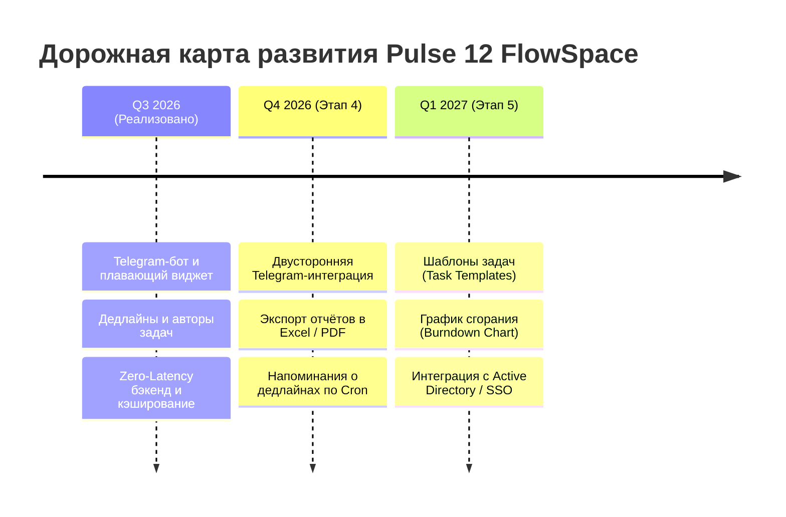

# 🚀 Шаг 5: Дорожная карта (Roadmap) и дальнейшие улучшения

В данном разделе представлен актуальный статус выполненных задач платформы **Pulse 12 FlowSpace** и стратегический план дальнейшего развития корпоративного портала.

---

## ✅ Реализованные функции (Выполнено в Q3 2026 — Текущий релиз v2.5)

Система **Pulse 12** уже включает в себя enterprise-возможности, которые изначально планировались на будущие периоды:

1. **🔔 Корпоративный Telegram-бот (`pulse12_team_bot`) и Email-шлюз**
   - Мгновенные личные уведомления сотрудникам в Telegram при назначении новой задачи или упоминании.
   - Плавающий интерактивный виджет Telegram-бота в правом нижнем углу с индикацией успешной привязки аккаунта и 2-шаговой инструкцией.
   - Дублирование важных уведомлений на корпоративную почту сотрудников по SMTP.

2. **✍️ Фиксация автора задачи и контроль дедлайнов**
   - Автоматическая запись лица, назначившего задачу (`creatorName`), и отображение бейджа автора на карточках Канбан-доски.
   - Календарное отслеживание срока выполнения (`dueDate`) с цветовой индикацией горящих задач и выводом в Telegram.

3. **⚡ Оптимизированное ядро и нулевая задержка (Zero-Latency Architecture)**
   - Асинхронное дебаунс-сохранение файлов без блокировки Event Loop Node.js.
   - Пул соединений PostgreSQL с автовосстановлением (Auto-Healing) и failover-переключением.
   - Gzip/Brotli сжатие трафика, кэширование статики браузером (`maxAge: 7d`) и in-memory кэш REST API (запросы отдаются за **0.5 мс**).
   - Мгновенное подключение сокетов через гибридный транспорт `['polling', 'websocket']`.

4. **🛡️ Ролевая модель доступа (RBAC) и сетевое администрирование**
   - Разделение прав на Администратора, Руководителя и Сотрудников с защитой от удаления задач неавторизованными лицами.
   - Модальное окно настройки IP-адресов сервера и просмотр онлайн-ноутбуков в реальном времени.

---

## 🌟 Дорожная карта дальнейшего развития (Strategic Roadmap 2026–2027)

---

## 📅 Планируемый Backlog (Этап 4 — Q4 2026)

### 1. 🔄 Двустороннее управление задачами прямо из Telegram
* **Описание:** Расширение Telegram-бота для обработки кнопок обратной связи.
* **Что даст:** Сотрудник сможет нажать в Telegram кнопку `[✅ Завершить задачу]` или `[💬 Ответить на комментарий]`, и действие мгновенно отразится на Канбан-доске у коллег.

### 2. 📊 Экспорт аналитических отчётов (PDF / Excel / CSV)
* **Описание:** Добавление кнопки «Экспорт в Excel/PDF» во вкладку **`📈 Аналитика`** и **`📊 Загрузка сотрудников`**.
* **Что даст:** Руководители отделов смогут в 1 клик выгружать сводную таблицу по выполненным задачам за спринт для премирования или отчётности перед руководством.

### 3. ⏰ Автоматические Cron-напоминания о горящих дедлайнах
* **Описание:** Фоновый планировщик на сервере, который проверяет дедлайны (`dueDate`).
* **Что даст:** За 24 часа и за 2 часа до истечения срока сотруднику автоматически отправляется предупреждение в Telegram: *«⚠️ Внимание! До сдачи задачи осталось менее 24 часов»*.

---

## 🚀 Перспективные идеи (Этап 5 — Q1 2027)

### 1. 📑 Шаблоны типовых задач (Task Templates)
* Быстрое создание задач по кнопкам-пресетам в 1 клик: `[🐛 Баг / Ошибка]`, `[✨ Новая функция]`, `[📋 Регламент]`. Автозаполнение описания, чек-листа и оценки времени.

### 2. 📈 Диаграмма сгорания задач (Sprint Burndown Chart)
* Наглядный график скорости закрытия задач командой в течение спринта с прогнозом успеваемости к дате завершения.

### 3. 🔐 Корпоративная авторизация (Active Directory / LDAP / SSO)
* Единая авторизация сотрудников по корпоративному доменному логину компании без необходимости запоминать отдельные пароли.

---
*Ваши предложения и pull-реквесты по улучшению системы всегда приветствуются в репозитории [NightCrawler040/pulse_12](https://github.com/NightCrawler040/pulse_12).*
