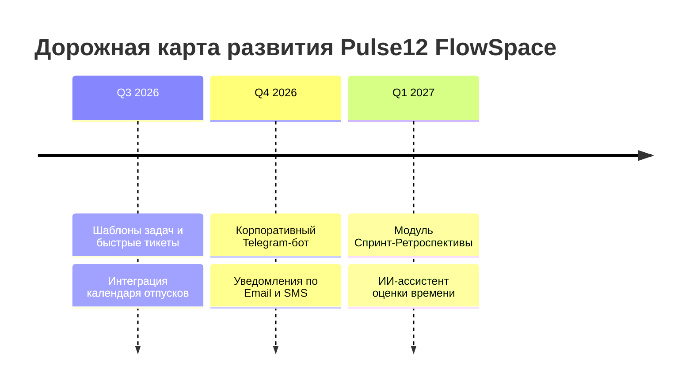

# 🚀 Шаг 5: Дорожная карта (Roadmap) и дальнейшие улучшения

В данном разделе собраны перспективные идеи и план развития платформы **Pulse12 FlowSpace** для дальнейшего повышения эффективности внутреннего корпоративного использования.

---

## 📅 Ближайшие запланированные улучшения (Next Sprint Backlog)

### 1. 📑 Шаблоны задач (Task Templates) для быстрого распределения
* **Проблема:** Руководителю часто приходится создавать однотипные задачи (например, «Оформление нового сотрудника», «Ежемесячный отчет», «Код-ревью»).
* **Решение:** Добавить в модальное окно создания задачи кнопки-шаблоны: `[🐛 Баг]`, `[✨ Новая фича]`, `[📋 Регламент]`, `[🛠️ Техдолг]`. При нажатии поля названия, описания, чек-листа и норматива времени будут заполняться автоматически в 1 клик.

### 2. 📅 Командный календарь и трекер отсутствий (Team Calendar & Leave Tracker)
* **Проблема:** При распределении задач начальник не всегда помнит, кто из сотрудников находится в отпускном графике или на больничном.
* **Решение:** Создать новую вкладку в верхнем меню **`📅 Календарь`**, где на единой сетке месяца отображаются дедлайны задач спринта, а также отпуска, больничные и отгулы сотрудников. Если начальник назначает задачу на сотрудника в отпуске, система выдаст предупреждение.

### 3. 💬 Внутризадачный мини-чат с поддержкой прикрепления голосовых сообщений
* **Проблема:** Текстовые комментарии не всегда передают все нюансы сложных технических инцидентов.
* **Решение:** Расширить текущий блок комментариев в карточке задачи до полноценного мини-чата с возможностью записи коротких аудио-комментариев прямо из браузера (через Web Audio API) и предпросмотром прикрепленных PDF-документов.

---

## 🌟 Перспективные идеи на будущее (Long-term Roadmap)

### 🤖 1. Корпоративный Telegram-бот и Email-шлюз
* Интеграция с Telegram API: при назначении срочной задачи (`Urgent`) или @упоминании сотрудник будет мгновенно получать уведомление в корпоративный рабочий мессенджер Telegram с кнопкой быстрого перехода в систему.
* Ежедневная утренняя сводка руководителю на почту: «За ночь выполнено 5 задач. В зоне риска по дедлайну 2 задачи».

### 📊 2. Модуль Спринт-Ретроспективы и KPI-аналитики
* По завершении спринта система будет формировать автоматический PDF-отчет для генерального директора с графиками скорости команды (Team Velocity), процентом попадания в оценки времени (Accuracy rate) и лучшими сотрудниками месяца по выработке Story Points.

### 🧠 3. ИИ-помощник (AI Assistant) для оценки трудоемкости
* Встроить локальную или облачную нейросеть, которая на основе истории прошлых задач компании будет подсказывать руководителю оптимальное время выполнения (`estimatedHours`) при формулировании текста нового задания.

---
*Ваши предложения по улучшению системы всегда приветствуются в репозитории [NightCrawler040/pulse_12](https://github.com/NightCrawler040/pulse_12).*
